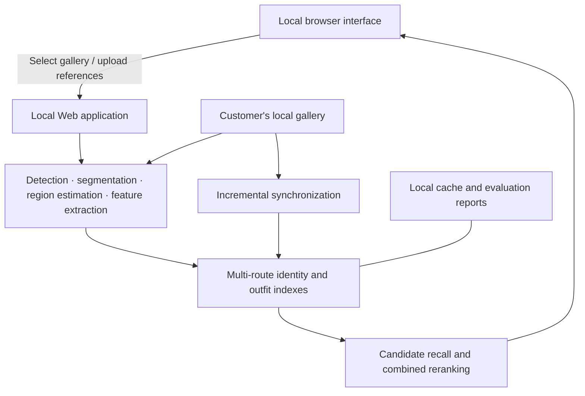

## From Reference Images to Explainable Local Asset Discovery

**A character, outfit, and local visual retrieval solution for anime and game CG assets**

> Intended for content production teams, asset operations teams, and asset management teams

## Executive Summary

As a character asset library grows from dozens to hundreds or thousands of images, traditional filenames, directory structures, and human memory quickly become ineffective. The same character may appear in different outfits, poses, expressions, and art styles; a single poster may contain several people; and transparent character art, event CGs, screenshots, and promotional images can vary significantly in composition.

Intelligent Character Asset Retrieval turns image discovery from manual browsing based on filenames and personal memory into local visual retrieval driven by reference images. Users provide **one to three PNG, JPG, or WEBP reference images**. The system then discovers characters in a specified local gallery, separates foregrounds, analyzes character and outfit features, recalls candidates through multiple retrieval routes, and combines color, texture, skin-exposure characteristics, and available tags for final ranking.

## Product Highlights

- **Designed for real production assets:** Supports anime and game CGs, transparent character art, multi-character images, and complex compositions rather than only standardized portrait images.
- **Explainable results:** The interface can display detection boxes, character masks, estimated part masks, tags, matched regions, and component scores to support result review.
- **Local data processing:** The product runs through a local browser after installation and can operate offline during daily use. Gallery and query images do not need to be uploaded to an external service.

The product does not replace final business judgment. Instead, it turns large-scale manual browsing into focused candidate review, making asset discovery more efficient and the basis of each result easier to understand.

## Background and Challenges

Anime and game asset management presents several common challenges:

1. **Unreliable filenames:** Assets may be named after dates, event IDs, or download sequences, without directly describing the character or outfit.
2. **Large visual variation within one character:** Costume changes, poses, half-body and full-body views, front and side views, card artwork, and character illustrations may differ substantially at the pixel level.
3. **Multi-character content is difficult to separate:** If the system treats the entire image as one object, other characters and the background can interfere with retrieval.
4. **Character similarity and outfit similarity are easily confused:** A single global similarity score may return different characters wearing similar clothing or miss the same character in another outfit.
5. **Sensitive assets should remain local:** Unreleased characters, event materials, and internal assets are often unsuitable for upload to public online tools.

## Intended Organizations and Teams

- **Art and content production teams:** Find historical assets for the same character, costume references, and local design details.
- **Asset operations and asset managers:** Support archiving, tag enrichment, duplicate checks, and delivery verification.
- **Data preparation and algorithm validation teams:** Build query sets, review candidates, and run reproducible evaluations.
- **Project management and acceptance teams:** Understand system capabilities, applicable boundaries, and iteration value through visualized processing stages.

The product is intended for organizations with a meaningful collection of anime, game CG, character illustration, event, or promotional assets that want to perform retrieval and management assistance locally.

## Algorithm Workflow

**1. Offline Gallery Indexing**

- Scan the gallery, isolate characters, and split multi-character images into separate instances to reduce interference from backgrounds and other characters.
- Extract identity, global outfit, and local outfit features, then build reusable local indexes.

**2. Online Query Understanding**

- Isolate characters and estimate relevant regions from one to three reference images, combining complementary information across multiple references.
- Build separate identity, global outfit, and local outfit signals instead of compressing “who the character is” and “what the character is wearing” into one score.

**3. Candidate Recall and Combined Ranking**

- Retrieve and merge candidates through three routes, then combine color, texture, skin-exposure ratio, and available tags for ranking.
- Return candidates, masks, matched clues, and component scores for user review.

## Product Demo

<video controls preload="metadata" width="100%">
  <source src="assets/video/product-demo.mp4" type="video/mp4">
  This document viewer does not support embedded video playback. Please use the link below.
</video>

[Open the product demo video](assets/video/product-demo.mp4)

## Product Architecture and Data Flow

The product consists of a local browser interface, a local application service, a visual processing pipeline, retrieval indexes, and local data directories.

By default, the service listens only on the local machine and is accessed through a local browser. The current product is intended for local, single-machine use. It is not an internet service or multi-user platform and should not be exposed directly to the public network.

## Application Scenarios

1. **Historical character asset discovery:** Start from an event image and find related character illustrations, card artwork, and promotional materials.
2. **Outfit and accessory retrieval:** Find similar tops, bottoms, shoes, or accessory designs to support art reference and consistency checks.
3. **Assisted asset archiving:** Provide candidate characters and visual relationships for poorly named images, followed by human confirmation and archiving.
4. **Duplicate and near-duplicate checks:** Discover assets with highly related subjects despite differences in composition, cropping, or background.
5. **Dataset preparation assistance:** Quickly create candidate groups and reduce the effort required to build positive samples, hard negatives, and query sets.
6. **Delivery acceptance and asset inventory:** Sample representative characters to review gallery coverage. The system can generate evaluation reports; long-term retention of human review conclusions should follow the customer's existing record process.

## Differentiated Advantages

1. **Vertical scenario adaptation:** Designed around anime and game CG characters rather than directly reusing general face or product retrieval methods.
3. **Character- and region-level understanding:** Moves from whole-image comparison to characters, face and hair regions, upper and lower clothing, shoes, and accessories.
4. **Multi-route retrieval:** Identity, global outfit, and local outfit routes jointly discover candidates before reranking with multiple signals.
5. **Explainable processing:** Masks, tags, matched regions, and component scores make results easier to validate.
6. **Locally deliverable:** Data does not need to leave the device. Daily operation can be offline after installation, with support for CPU and compatible GPUs.
7. **Designed for continued maintenance:** Includes incremental gallery synchronization, portable caches, evaluation reports, and an incremental delivery foundation.

## FAQ

**Does the entire index need to be rebuilt after adding images to the gallery?**

No. Enhanced mode supports incremental synchronization. It identifies added, deleted, and file-size-based changes, re-extracts only the files that require updates, and then updates the indexes.

**Can the gallery and indexes be copied to another machine?**

They can be reused when the required conditions are met. The gallery identifier file and relative directory structure must be preserved, and the corresponding index cache must be copied separately. Validation should be run after migration.

**Is a GPU required?**

No. A compatible NVIDIA GPU can be used when available. The system falls back to CPU when the GPU is unavailable or incompatible. Actual performance depends on the device, drivers, gallery size, and image complexity.

**Will the system automatically replace asset archiving staff?**

No. It is better suited to candidate discovery, ranking, and explanation, allowing people to focus on business judgment, naming standards, and final confirmation.
