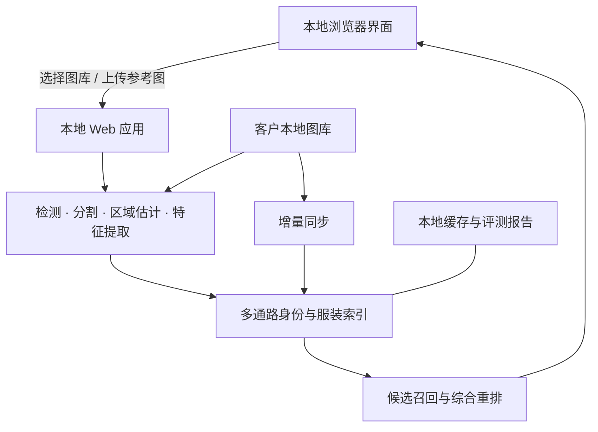

## 从参考图到可解释的本地资产检索

**面向二次元与游戏 CG 资产的角色、服装与局部视觉检索方案**

> 面向内容制作团队、资产运营团队与资产管理团队

## 摘要

当角色资产库从几十张增长到几百甚至上千张，传统的文件名、目录结构与人的记忆很快就失效了。同一个角色可能以不同服装、姿势、表情与画风出现；一张海报里可能有多个人物；而透明底角色立绘、活动 CG、截图与宣传图在构图上差异很大。

智能角色资产检索把「翻文件」从依赖文件名和个人记忆的人工浏览，变成由参考图驱动的本地视觉检索。用户提供**一到三张 PNG、JPG 或 WEBP 参考图**。系统随即在指定的本地图库中检出角色、分离前景、分析角色与服装特征，通过多条检索通路召回候选，并结合颜色、纹理、皮肤暴露特征与可用标签做最终排序。

## 产品亮点

- **面向真实生产资产：** 支持二次元与游戏 CG、透明底角色立绘、多人图与复杂构图，而不只是标准化的人像图。
- **结果可解释：** 界面可展示检测框、角色掩码、估计的部件掩码、标签、匹配区域与各项分量得分，便于复核结果。
- **本地数据处理：** 产品安装后通过本地浏览器运行，日常使用可离线。图库与查询图无需上传到外部服务。

本产品不替代最终的业务判断。它把大规模人工浏览收敛成有的放矢的候选复核，让资产发现更高效，也让每条结果的依据更容易被理解。

## 背景与挑战

二次元与游戏资产管理常见几类挑战：

1. **文件名不可靠：** 资产可能以日期、活动 ID 或下载顺序命名，并不直接描述角色或服装。
2. **同一角色视觉差异大：** 换装、姿势、半身与全身、正面与侧面、卡面与角色立绘在像素层面可能相差很大。
3. **多人内容难以分离：** 如果系统把整张图当成一个对象，其他角色与背景会干扰检索。
4. **角色相似与服装相似容易混淆：** 单一的全局相似度分数可能召回穿着相似服装的不同角色，或漏掉换了装的同一角色。
5. **敏感资产应留在本地：** 未公开角色、活动物料与内部资产往往不适合上传到公网在线工具。

## 适用组织与团队

- **美术与内容制作团队：** 查找同一角色的历史资产、服装参考与局部设计细节。
- **资产运营与资产管理员：** 支撑归档、标签补全、重复检查与交付验收。
- **数据准备与算法验证团队：** 构建查询集、复核候选、跑可复现的评测。
- **项目管理与验收团队：** 通过可视化的处理阶段理解系统能力、适用边界与迭代价值。

本产品适用于拥有一定规模的二次元、游戏 CG、角色立绘、活动或宣传资产，并希望在本地做检索与管理辅助的组织。

## 算法流程

**1. 离线图库建索引**

- 扫描图库、分离角色，并把多人图拆成独立实例，降低背景与其他角色的干扰。
- 提取身份特征、全局服装特征与局部服装特征，构建可复用的本地索引。

**2. 在线查询理解**

- 从一到三张参考图中分离角色并估计相关区域，跨多张参考图互补信息。
- 分别构建身份、全局服装与局部服装信号，而不是把「这是谁」和「穿什么」压进一个分数。

**3. 候选召回与综合排序**

- 通过三条通路检索并合并候选，再结合颜色、纹理、皮肤暴露比例与可用标签排序。
- 返回候选、掩码、匹配线索与分量得分供用户复核。

## 产品演示

<video controls preload="metadata" width="100%">
  <source src="assets/video/product-demo.mp4" type="video/mp4">
  当前文档查看器不支持内嵌视频播放，请使用下方链接。
</video>

[打开产品演示视频](assets/video/product-demo.mp4)

## 产品架构与数据流

产品由本地浏览器界面、本地应用服务、视觉处理流水线、检索索引与本地数据目录组成。

默认情况下服务只监听本机，通过本地浏览器访问。当前产品面向本地单机使用，不是互联网服务或多用户平台，不应直接暴露到公网。

## 应用场景

1. **历史角色资产发现：** 从一张活动图出发，找出相关的角色立绘、卡面与宣传物料。
2. **服装与配饰检索：** 找出相似的上装、下装、鞋或配饰设计，支撑美术参考与一致性检查。
3. **辅助资产归档：** 为命名混乱的图片提供候选角色与视觉关联，再由人工确认并归档。
4. **重复与近似重复检查：** 发现主体高度相关、但构图、裁切或背景不同的资产。
5. **数据集准备辅助：** 快速生成候选组，降低构建正样本、难负样本与查询集的工作量。
6. **交付验收与资产盘点：** 抽样代表性角色以检视图库覆盖度。系统可生成评测报告；人工复核结论的长期留存应遵循客户既有的记录流程。

## 差异化优势

1. **垂直场景适配：** 围绕二次元与游戏 CG 角色设计，而不是直接套用通用人脸或商品检索方法。
3. **角色与区域级理解：** 从整图比对推进到角色、面部与头发区域、上下装、鞋与配饰。
4. **多通路检索：** 身份、全局服装与局部服装三条通路共同召回候选，再用多信号重排。
5. **可解释的处理过程：** 掩码、标签、匹配区域与分量得分让结果更易于验证。
6. **可本地交付：** 数据无需离开设备。安装后日常可离线运行，支持 CPU 与兼容 GPU。
7. **为持续维护而设计：** 含图库增量同步、可迁移缓存、评测报告与增量交付基础。

## 常见问题

**往图库里加图后，整个索引需要重建吗？**

不需要。增强模式支持增量同步。它会识别新增、删除与基于文件大小的变化，只对需要更新的文件重新提取特征，再更新索引。

**图库和索引能拷贝到另一台机器上吗？**

满足前提条件时可以复用。必须保留图库标识文件与相对目录结构，且需要单独拷贝对应的索引缓存。迁移后应跑一次校验。

**必须要 GPU 吗？**

不是。可用时会使用兼容的 NVIDIA GPU；GPU 不可用或不兼容时回退到 CPU。实际性能取决于设备、驱动、图库规模与图片复杂度。

**系统会自动取代资产归档人员吗？**

不会。它更擅长候选发现、排序与解释，让人把精力集中在业务判断、命名规范与最终确认上。
