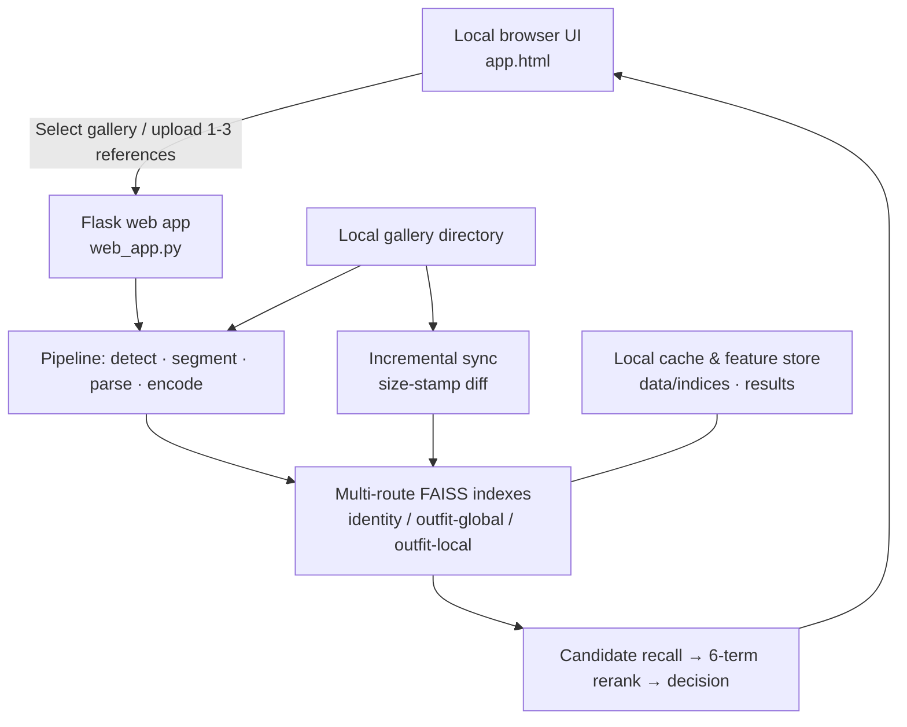
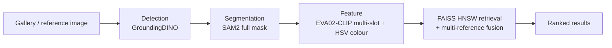
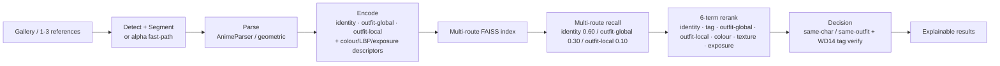

# NIKKE Retrieval (YX Retrieval): Offline Character & Costume Retrieval for Game CG Assets

> An offline, local-first image retrieval system that finds the same character or the same outfit across a game-art gallery from one to three reference images — built around anime / game CG assets (NIKKE), with explainable, region-level results.

NIKKE Retrieval is the packaged, fully-offline build of the **YX Retrieval** character/costume retrieval engine (Python package `yx-retrieval`, v0.1.0). It is delivered as `nikke_retrieval_v1.0`: every model weight, cache, pip wheel, and the Python 3.10 installer are bundled, so the tool runs 100% offline after a one-time setup. The product is intended for content-production, asset-operations, and asset-management teams that hold a meaningful collection of character art, event CG, card artwork, and promotional images and want to search them visually instead of by filename or memory.

The system ships **two pipelines that coexist** in the same process:

- **V2 (recommended):** decouples *identity* (who) from *outfit* (what they wear), retrieves through multiple routes, and re-ranks with six weighted signals plus a tag-based decision layer — the mode for precise analysis.
- **V1 (legacy):** the original 4-stage pipeline, kept for comparison and as a fallback reference.

---

## 1. Background and challenges

As a character asset library grows from dozens to hundreds or thousands of images, filenames, directory structures, and human memory stop working. The same character appears in many outfits, poses, expressions, and art styles; a single poster may contain several characters; and transparent character art, event CG, screenshots, and promo images vary widely in composition.

1. **Unreliable filenames** — assets named after dates, event IDs, or download sequences, with no description of the character or outfit.
2. **Large intra-character variation** — costume changes, half/full-body views, front/side views, and card art differ substantially at the pixel level.
3. **Multi-character content is hard to separate** — treating the whole image as one object lets other characters and the background contaminate retrieval.
4. **Identity and outfit similarity are easily confused** — a single global score may return a different character in similar clothes, or miss the same character in a different outfit.
5. **Sensitive assets must stay local** — unreleased characters, event materials, and internal assets should not be uploaded to public online tools.

NIKKE Retrieval turns discovery from manual browsing into local, reference-image-driven visual search, while keeping every image on the operator's machine.

---

## 2. Product positioning and scope

> **Upload one to three reference images; the system isolates characters, analyzes identity and outfit, recalls candidates through multiple routes, and returns ranked, explainable matches from a chosen local gallery.**

The product contract:

| Item | Behavior |
| --- | --- |
| Input | 1–3 PNG / JPG / WEBP reference images; a chosen local gallery directory (supports recursive sub-directory scanning). |
| Output | Ranked candidate images with similarity score, optional detection boxes, instance masks, estimated part masks, WD14 tags, matched regions, and per-signal score breakdowns. |
| Deployment | Local Flask web app + browser UI; also importable as a Python library (`yx_retrieval`). |
| Engine duties | Detection, segmentation, semantic part-parsing, multi-slot / multi-route feature extraction, FAISS indexing, multi-reference fusion, re-rank, and decision. |
| Runtime principle | Gallery and query images never leave the machine; daily operation is offline after install; auto-detects NVIDIA GPU and falls back to CPU. |
| Scope | Same-character and same-outfit discovery across a gallery; not a generator, tagger, or auto-archiver — it produces candidates for human review. |

The product does not replace final business judgment. It converts large-scale manual browsing into focused candidate review, and makes the basis of each result easy to audit.

---

## 3. Application scenarios

| Scenario | What the operator does | Why it helps |
| --- | --- | --- |
| Historical character-asset discovery | Start from an event image; find related illustrations, card art, and promo materials of the same character. | Reuses existing assets instead of re-searching by name. |
| Outfit and accessory retrieval | Find similar tops, bottoms, shoes, or accessories to support art reference and consistency checks. | Region-level signals separate "same outfit" from "same character". |
| Assisted archiving | Generate candidate characters and visual relationships for poorly named images; human confirms and archives. | Turns a nameless file into a reviewable shortlist. |
| Duplicate / near-duplicate checks | Discover assets with related subjects despite differences in composition, crop, or background. | Catches redundancy that filename comparison misses. |
| Dataset / query-set preparation | Build candidate groups quickly for positive samples, hard negatives, and evaluation sets. | Cuts the effort of assembling query sets by hand. |
| Delivery acceptance & inventory | Sample representative characters to review gallery coverage. | Gives a coverage signal before final delivery. |

---

## 4. System architecture and data flow

The product is a local browser interface talking to a local application service, which drives a visual-processing pipeline, builds retrieval indexes, and reads/writes only local data directories.



By default the service listens only on the local machine and is opened through a local browser. It is a local, single-machine tool — not an internet service or multi-user platform, and should not be exposed to the public network.

---

## 5. Retrieval pipeline

Both versions share the same front-end orchestration (`RetrievalPipeline` for V1, `RetrievalPipelineV2` for V2) and can run in the same Python process, even sharing the same EVA02-CLIP weights file.

### 5.1 V1 — 4-stage coupled pipeline



1. **Detection (GroundingDINO)** — locates character bounding boxes from the prompt `character . person`, with NMS and a large-box re-check that splits multi-character KV / banner crops by head detections.
2. **Segmentation (SAM2)** — produces a full instance mask per box; overlapping masks are merged by IoU / containment / center-distance heuristics tuned for crowd scenes.
3. **Feature extraction (EVA02-CLIP)** — extracts a hybrid vector per crop slot (`global`, `hair`, `upper_body`, `torso`) and appends an HSV colour histogram (hue 48 / sat 16 bins) with a configurable colour share (`color_weight = 0.3`).
4. **Retrieval (FAISS HNSW)** — cosine-similarity search over an `hnsw_flat` index (`m = 32`, `ef_construction = 200`, `ef_search = 128`); multiple references are fused with a geometric-mean ensemble (`prototype_weight = 0.6`, `max_ref_weight = 0.4`, up to 3 references).

### 5.2 V2 — 7-stage decoupled pipeline (recommended)



New relative to V1:

- **Parse (stage 2b)** — semantic part-parsing via `AnimeParser` (imgutils-backed) with a geometric fallback; estimates face / hair / half-body / hand / pose regions so identity and outfit can be measured on the right pixels.
- **Encode (stage 3)** — three separate routes share one CLIP backbone: `IdentityEncoder` (routes face∪hair through the anime-character **CCIP** model to separate same-art-style characters), `OutfitGlobalEncoder`, and `OutfitLocalEncoder`; plus colour / LBP / exposure descriptors.
- **Multi-route index (stage 4)** — `MultiRouteIndex` keeps independent FAISS routes for identity, outfit-global, and outfit-local.
- **Recall (stage 5)** — recalls `k_total = 500` candidates by per-route quota (`identity 0.60`, `outfit_global 0.30`, `outfit_local 0.10`), then deduplicates.
- **Rerank (stage 6)** — a weighted blend of seven signals: `identity 0.25`, `tag_identity 0.25`, `outfit_global 0.20`, `outfit_local 0.15`, `colour 0.10`, `texture 0.10`, `exposure 0.05`.
- **Decision (stage 7)** — classifies each survivor as same-character / same-outfit against thresholds (`tau_identity 0.78`, `tau_outfit 0.96`, `tau_colour 0.90`) with an edge-band Jaccard escape hatch and optional WD14 tag verification (`character_threshold 0.85`).

### 5.3 Engineering details that matter in production

| Concern | Implementation |
| --- | --- |
| **Alpha fast-path** | Pre-cut transparent assets (e.g. OB13 character sheets) skip GroundingDINO + SAM2 and are split into one instance per connected component — faster *and* more accurate than detecting already-cutout art. |
| **Incremental indexing** | `build_index` diffs the gallery against per-file **size stamps** and re-extracts only added / modified / removed files; unchanged galleries are a cheap no-op scan. Stamps use file size (not mtime) so an index copied to another machine is reused as-is. |
| **Portable caches** | Stored source paths are gallery-relative; an index stays valid after the gallery moves or is copied between machines. Legacy cache formats are migrated transparently on load. |
| **GPU memory management** | Lazy model loading; optional park-to-CPU between stages so GD / SAM2 / CLIP never co-reside on a 6 GB card; automatic CUDA-OOM → CPU fallback per stage. |
| **Multi-reference fusion** | Up to 3 references are fused (geometric-mean by default) so multiple angles beat a single shot. |
| **Explainability** | The UI can render detection boxes, instance masks, estimated part masks, WD14 tags, matched regions, and per-signal score breakdowns for every hit. |

---

## 6. Capabilities and current boundaries

### 6.1 Current capabilities

| Capability | Behavior |
| --- | --- |
| Two pipelines | V1 (coupled identity/outfit) and V2 (decoupled, multi-route, rerank + decision) run side by side. |
| Local galleries | Recursive scanning of any local image directory; multiple bundled demo galleries. |
| Reference-driven query | 1–3 reference images; multi-angle fusion improves accuracy over a single shot. |
| Region-level understanding | Moves from whole-image comparison to character, face/hair, upper/lower clothing, shoes, and accessories. |
| Multi-route retrieval & rerank | Identity / outfit-global / outfit-local routes + 6-term weighted rerank + decision. |
| Offline operation | Fully offline after one-time setup; bundled weights (~3 GB), HF cache (~1 GB), and pip wheels (~3 GB). |
| Device flexibility | Auto-detects CUDA GPU; falls back to CPU; per-stage device overrides for low-VRAM machines. |
| Explainable output | Boxes, masks, part masks, tags, matched regions, and score breakdowns per result. |

### 6.2 Current boundaries

- Built for anime / game CG character art (transparent sheets, event CG, card art, promos) rather than generic photos or product shots.
- A gallery with no detectable character instances yields nothing to index — check that the gallery holds character art, not backgrounds / UI.
- V2's CCIP identity route and WD14 tag verification depend on the `imgutils` backend; if it is absent, those signals silently degrade to zero rather than failing the run.
- Index rebuild is in-memory over changed files only, but FAISS has no incremental remove — any diff rebuilds all routes from the cached feature list (cheap relative to re-running detection/segmentation).
- The product assists review; final naming, archiving, and acceptance remain human decisions.

---

## 7. Environment and deployment

| Item | Requirement / behavior |
| --- | --- |
| Platform | Windows 10 / 11 (64-bit) primary; macOS launch script provided. |
| Python | 3.10 (bundled installer in the delivery package). |
| Memory | ≥ 8 GB (16 GB recommended). |
| Disk | ≥ 10 GB free for weights, cache, and wheels. |
| Compute | NVIDIA GPU optional — auto-detected, 5–10× faster; CPU fallback otherwise. |
| Network | None required — 100% offline after install. |
| Launch (Windows) | `first_install.bat` once, then `start.bat` daily. |
| Launch (macOS) | `first_install_macos.sh` once, then `start_macos.sh` daily. |
| Configuration | YAML merged with dataclass defaults: `config/default.yaml`, `config/demo.yaml`, `config/v2.yaml`. |
| Bundled models | `models/groundingdino`, `models/sam2`, `models/eva02_clip` (+ `ELVA02-CLIP`); CCIP / WD14 via imgutils ONNX. |

---

## 8. Getting started (summary)

The full install/usage instructions live in the project's `README.txt`. In short:

1. **One-time setup** — run `first_install.bat` (Windows) / `first_install_macos.sh` (macOS). It checks Python, creates an isolated `venv`, installs all dependencies from the bundled `wheels/` offline, and tests critical imports.
2. **Daily launch** — run `start.bat` / `start_macos.sh`; the console logs appear, then a browser opens to the retrieval page automatically (~30–60 s).
3. **In the UI** — pick the pipeline (**V2 recommended**), pick or paste a gallery path, upload 1–3 reference images, click **Build Index** the first time a gallery is visited, then **Run**. Drag the **Score >** slider to filter low-scoring candidates; click a hit card for the full detail view (mask, part parsing, WD14 tags).

Programmatic use:

```python
from yx_retrieval.config import AppConfig
from yx_retrieval.pipeline_v2 import RetrievalPipelineV2

cfg = AppConfig.from_yaml("config/v2.yaml")
pipe = RetrievalPipelineV2(cfg)
pipe.build_index("OB13/")
results = pipe.query(["OB13/ele_char_alice_main.png"], top_k=10)
```

---

## 9. FAQ

**Does the whole index need to be rebuilt after adding images to the gallery?**

No. V2 supports incremental synchronization: it detects added / removed / size-changed files, re-extracts only what changed, and updates the indexes. An unchanged gallery is a cheap no-op scan.

**Can the gallery and indexes be copied to another machine?**

Yes, when conditions are met. Stored paths are gallery-relative and stamps are file sizes, so an index copied alongside its gallery is reused as-is. Run a validation build after migration.

**Is a GPU required?**

No. A compatible NVIDIA GPU is used when available (5–10× faster); otherwise the system falls back to CPU. Check the first console log line — `[auto-detect] using device:` — to confirm which device was selected.

**Why didn't the image I wanted appear in the results?**

Lower the **Score >** slider (e.g. from 0.5 to 0.3). If it still does not appear, V2 may not have recognized it; review the detection / parsing thresholds in the V2 config or contact support.

**Will this replace asset-archiving staff?**

No. It is better suited to candidate discovery, ranking, and explanation, letting people focus on business judgment, naming standards, and final confirmation.

**How do I fully uninstall?**

Delete the extracted directory. There are no registry or service residuals.
