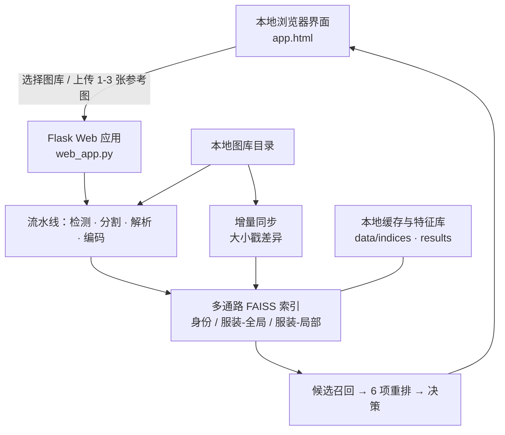
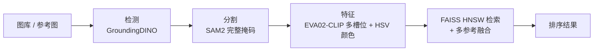

# NIKKE Retrieval（YX Retrieval）：面向游戏 CG 资产的离线角色与服装检索

> 一套本地优先、全离线的图像检索系统，从一到三张参考图出发，在游戏美术图库中找出相同角色或相同服装——围绕二次元 / 游戏 CG 资产（NIKKE）构建，结果可解释、支持区域级。

NIKKE Retrieval 是 **YX Retrieval** 角色/服装检索引擎（Python 包 `yx-retrieval`，v0.1.0）的打包全离线版本。它以 `nikke_retrieval_v1.0` 交付：所有模型权重、缓存、pip wheel 与 Python 3.10 安装器都随包附带，因此一次性安装后即可 100% 离线运行。产品面向内容制作、资产运营与资产管理团队——他们持有一定规模的角色立绘、活动 CG、卡面与宣传图，并希望用视觉而非文件名或记忆来检索。

系统在同一进程内**并存两条流水线**：

- **V2（推荐）：** 把*身份*（是谁）与*服装*（穿什么）解耦，通过多条通路检索，并用六个加权信号加一个基于标签的决策层做重排——这是用于精确分析的模式。
- **V1（遗留）：** 最初的 4 阶段流水线，保留用于对比与作为回退参考。

---

## 1. 背景与挑战

当角色资产库从几十张增长到几百甚至上千张，文件名、目录结构与人的记忆就都失效了。同一角色会以不同服装、姿势、表情与画风出现；一张海报里可能包含多个角色；而透明底角色立绘、活动 CG、截图与宣传图在构图上差异很大。

1. **文件名不可靠** —— 资产可能以日期、活动 ID 或下载顺序命名，并不描述角色或服装。
2. **同一角色内部差异大** —— 换装、半身/全身、正面/侧面与卡面在像素层面相差很大。
3. **多人内容难以分离** —— 如果把整张图当成一个对象，其他角色与背景会污染检索。
4. **身份相似与服装相似容易混淆** —— 单一的全局分数可能召回穿着相似服装的不同角色，或漏掉换了装的同一角色。
5. **敏感资产必须留在本地** —— 未公开角色、活动物料与内部资产不应上传到公网在线工具。

NIKKE Retrieval 把发现过程从人工浏览，变成由参考图驱动的本地视觉检索，同时保证每张图都不离开操作者的机器。

---

## 2. 产品定位与范围

> **上传一到三张参考图；系统分离角色、分析身份与服装、通过多条通路召回候选，并从选定的本地图库返回已排序、可解释的匹配结果。**

产品契约：

| 项目 | 行为 |
| --- | --- |
| 输入 | 1–3 张 PNG / JPG / WEBP 参考图；一个选定的本地图库目录（支持递归子目录扫描） |
| 输出 | 带相似度分数的候选排序图，以及可选的检测框、实例掩码、估计的部件掩码、WD14 标签、匹配区域与逐信号分数拆解 |
| 部署 | 本地 Flask Web 应用 + 浏览器 UI；也可以作为 Python 库导入（`yx_retrieval`） |
| 引擎职责 | 检测、分割、语义部件解析、多槽位/多通路特征提取、FAISS 建索引、多参考融合、重排与决策 |
| 运行原则 | 图库与查询图永不离开本机；安装后日常使用完全离线；自动检测 NVIDIA GPU 并在没有时回退 CPU |
| 范围 | 跨图库的同角色与同服装发现；它不是生成器、打标器或自动归档工具——它产出供人工评审的候选 |

本产品不替代最终的业务判断。它把大规模人工浏览收敛成聚焦的候选评审，并让每条结果的依据更容易被审计。

---

## 3. 应用场景

| 场景 | 操作者做什么 | 它带来什么价值 |
| --- | --- | --- |
| 历史角色资产发现 | 从一张活动图出发，找出同一角色的相关立绘、卡面与宣传物料 | 复用已有资产，而不是按名字反复搜 |
| 服装与配饰检索 | 找出相似的上装、下装、鞋或配饰，支撑美术参考与一致性检查 | 区域级信号把「同服装」与「同角色」区分开 |
| 辅助归档 | 为命名混乱的图片生成候选角色与视觉关联；由人工确认并归档 | 把一个无名文件变成一份可评审的候选清单 |
| 重复 / 近似重复检查 | 发现主体相关、但在构图、裁切或背景上不同的资产 | 抓到文件名比对漏掉的冗余 |
| 数据集 / 查询集准备 | 快速为正样本、难负样本与评测集构造候选组 | 减少手工拼装查询集的工作量 |
| 交付验收与盘点 | 抽样代表性角色以检视图库覆盖度 | 在最终交付前给出一个覆盖度信号 |

---

## 4. 系统架构与数据流

产品是一个本地浏览器界面，与一个本地应用服务通信；后者驱动视觉处理流水线、构建检索索引，并只读写本地数据目录。



默认情况下服务只监听本机，通过本地浏览器打开。它是一个本地单机工具——不是互联网服务或多用户平台，不应暴露到公网。

---

## 5. 检索流水线

两个版本共用同一套前端编排（V1 用 `RetrievalPipeline`，V2 用 `RetrievalPipelineV2`），并且可以跑在同一个 Python 进程里，甚至共用同一个 EVA02-CLIP 权重文件。

### 5.1 V1 —— 4 阶段耦合流水线



1. **检测（GroundingDINO）** —— 用 prompt `character . person` 定位角色包围框，配合 NMS 与一次大框复检：通过头部检测把多角色 KV / banner 裁图拆开。
2. **分割（SAM2）** —— 为每个框产出完整实例掩码；重叠掩码按为人群场景调过的 IoU / 包含 / 中心距离启发式合并。
3. **特征提取（EVA02-CLIP）** —— 为每个裁剪槽位（`global`、`hair`、`upper_body`、`torso`）抽取一个混合向量，并追加一个 HSV 颜色直方图（色相 48 / 饱和度 16 个 bin），颜色占比可配置（`color_weight = 0.3`）。
4. **检索（FAISS HNSW）** —— 在 `hnsw_flat` 索引上做余弦相似度检索（`m = 32`，`ef_construction = 200`，`ef_search = 128`）；多张参考图用几何平均集成融合（`prototype_weight = 0.6`，`max_ref_weight = 0.4`，最多 3 张参考）。

### 5.2 V2 —— 7 阶段解耦流水线（推荐）


相对 V1 的新增：

- **解析（阶段 2b）** —— 通过 `AnimeParser`（imgutils 支撑）做语义部件解析，并带几何回退；估计面部 / 头发 / 半身 / 手部 / 姿态区域，从而让身份与服装在正确的像素上被度量。
- **编码（阶段 3）** —— 三条独立通路共用一个 CLIP 骨干：`IdentityEncoder`（把 face∪hair 送进二次元角色 **CCIP** 模型，以区分同画风角色）、`OutfitGlobalEncoder` 与 `OutfitLocalEncoder`；外加颜色 / LBP / 曝光描述子。
- **多通路索引（阶段 4）** —— `MultiRouteIndex` 为身份、服装-全局、服装-局部各维护独立的 FAISS 通路。
- **召回（阶段 5）** —— 按各通路配额（`identity 0.60`、`outfit_global 0.30`、`outfit_local 0.10`）召回 `k_total = 500` 个候选，然后去重。
- **重排（阶段 6）** —— 七个信号的加权融合：`identity 0.25`、`tag_identity 0.25`、`outfit_global 0.20`、`outfit_local 0.15`、`colour 0.10`、`texture 0.10`、`exposure 0.05`。
- **决策（阶段 7）** —— 按阈值（`tau_identity 0.78`、`tau_outfit 0.96`、`tau_colour 0.90`）把每个存活候选分类为同角色 / 同服装，并带一个边缘带 Jaccard 逃生口，以及可选的 WD14 标签校验（`character_threshold 0.85`）。

### 5.3 生产中真正重要的工程细节

| 关注点 | 实现 |
| --- | --- |
| **Alpha 快速通道** | 预切好的透明资产（例如 OB13 角色表）跳过 GroundingDINO + SAM2，按连通域拆成每个实例一个——对已经是抠图成品的美术，这既更快也更准 |
| **增量建索引** | `build_index` 用每文件的**大小戳**与图库做差异比对，只对新增 / 修改 / 删除的文件重新提取特征；未变化的图库只是一次廉价的空扫描。戳用的是文件大小（不是 mtime），因此拷到另一台机器的索引可以原样复用 |
| **可移植缓存** | 存储的源路径是相对图库的；图库移动或在机器间拷贝后，索引依然有效。旧版缓存格式在加载时透明迁移 |
| **显存管理** | 模型懒加载；阶段之间可选地把模型挪回 CPU，使 GD / SAM2 / CLIP 不会同时占在一张 6 GB 卡上；CUDA-OOM 时按阶段自动回退 CPU |
| **多参考融合** | 最多 3 张参考图做融合（默认几何平均），因此多个角度优于单张 |
| **可解释性** | 界面可以为每个命中结果渲染检测框、实例掩码、估计的部件掩码、WD14 标签、匹配区域与逐信号分数拆解 |

---

## 6. 能力与当前边界

### 6.1 当前能力

| 能力 | 行为 |
| --- | --- |
| 两条流水线 | V1（身份/服装耦合）与 V2（解耦、多通路、重排 + 决策）并存运行 |
| 本地图库 | 递归扫描任意本地图片目录；内置多个演示图库 |
| 参考图驱动查询 | 1–3 张参考图；多角度融合相比单张能提升准确率 |
| 区域级理解 | 从整图比对推进到角色、面部/头发、上/下装、鞋与配饰 |
| 多通路检索与重排 | 身份 / 服装-全局 / 服装-局部三条通路 + 6 项加权重排 + 决策 |
| 离线运行 | 一次性安装后完全离线；随包附带权重（约 3 GB）、HF 缓存（约 1 GB）与 pip wheel（约 3 GB） |
| 设备弹性 | 自动检测 CUDA GPU；无 GPU 时回退 CPU；低显存机器可按阶段覆盖设备 |
| 可解释输出 | 每个结果都提供框、掩码、部件掩码、标签、匹配区域与分数拆解 |

### 6.2 当前边界

- 面向二次元 / 游戏 CG 角色美术（透明角色表、活动 CG、卡面、宣传图），而不是通用照片或商品图。
- 一个检测不到任何角色实例的图库，没有什么可建索引的——请确认图库里装的是角色美术，而不是背景 / UI。
- V2 的 CCIP 身份通路与 WD14 标签校验依赖 `imgutils` 后端；如果它缺失，这些信号会静默退化为零，而不会让整次运行失败。
- 索引重建只对变化的文件在内存中做，但 FAISS 没有增量删除——任何差异都会从缓存的特征列表重建所有通路（相对于重跑检测/分割而言仍然便宜）。
- 本产品辅助评审；最终的命名、归档与验收仍是人的决定。

---

## 7. 环境与部署

| 项目 | 要求 / 行为 |
| --- | --- |
| 平台 | 主要支持 Windows 10 / 11（64 位）；提供 macOS 启动脚本 |
| Python | 3.10（交付包内含安装器） |
| 内存 | ≥ 8 GB（推荐 16 GB） |
| 磁盘 | ≥ 10 GB 可用空间，用于权重、缓存与 wheel |
| 算力 | NVIDIA GPU 可选——自动检测，快 5–10 倍；否则回退 CPU |
| 网络 | 不需要——安装后 100% 离线 |
| 启动（Windows） | 先跑一次 `first_install.bat`，之后日常用 `start.bat` |
| 启动（macOS） | 先跑一次 `first_install_macos.sh`，之后日常用 `start_macos.sh` |
| 配置 | YAML 与 dataclass 默认值合并：`config/default.yaml`、`config/demo.yaml`、`config/v2.yaml` |
| 随包模型 | `models/groundingdino`、`models/sam2`、`models/eva02_clip`（+ `ELVA02-CLIP`）；CCIP / WD14 经 imgutils ONNX |

---

## 8. 快速上手（摘要）

完整的安装/使用说明见项目的 `README.txt`。简而言之：

1. **一次性安装** —— 运行 `first_install.bat`（Windows）/ `first_install_macos.sh`（macOS）。它会检查 Python、创建隔离的 `venv`、从随包的 `wheels/` 离线安装所有依赖，并测试关键导入。
2. **日常启动** —— 运行 `start.bat` / `start_macos.sh`；控制台日志出现后，浏览器会自动打开检索页面（约 30–60 秒）。
3. **在界面里** —— 选择流水线（**推荐 V2**），选择或粘贴图库路径，上传 1–3 张参考图，首次访问某个图库时点击 **Build Index**，然后 **Run**。拖动 **Score >** 滑块过滤低分候选；点击某条命中卡片可查看完整详情（掩码、部件解析、WD14 标签）。

编程调用：

```python
from yx_retrieval.config import AppConfig
from yx_retrieval.pipeline_v2 import RetrievalPipelineV2

cfg = AppConfig.from_yaml("config/v2.yaml")
pipe = RetrievalPipelineV2(cfg)
pipe.build_index("OB13/")
results = pipe.query(["OB13/ele_char_alice_main.png"], top_k=10)
```

---

## 9. 常见问题

**往图库里加图后，整个索引需要重建吗？**

不需要。V2 支持增量同步：它识别新增 / 删除 / 大小变化的文件，只对变化的部分重新提取特征，并更新索引。未变化的图库只是一次廉价的空扫描。

**图库和索引能拷贝到另一台机器上吗？**

满足前提条件时可以。存储的路径是相对图库的，戳用的是文件大小，因此与图库一起拷贝的索引可以原样复用。迁移后应跑一次验证性的 build。

**必须要 GPU 吗？**

不是。可用时使用兼容的 NVIDIA GPU（快 5–10 倍）；否则系统回退到 CPU。看控制台第一行日志——`[auto-detect] using device:`——即可确认选中的是哪个设备。

**为什么我想要的图没出现在结果里？**

把 **Score >** 滑块调低（例如从 0.5 到 0.3）。如果还是没出现，可能 V2 没有识别它；请复核 V2 配置里的检测 / 解析阈值，或联系支持。

**它会取代资产归档人员吗？**

不会。它更擅长候选发现、排序与解释，让人把精力集中在业务判断、命名规范与最终确认上。

**如何彻底卸载？**

删除解压出来的目录即可。没有注册表或服务残留。
